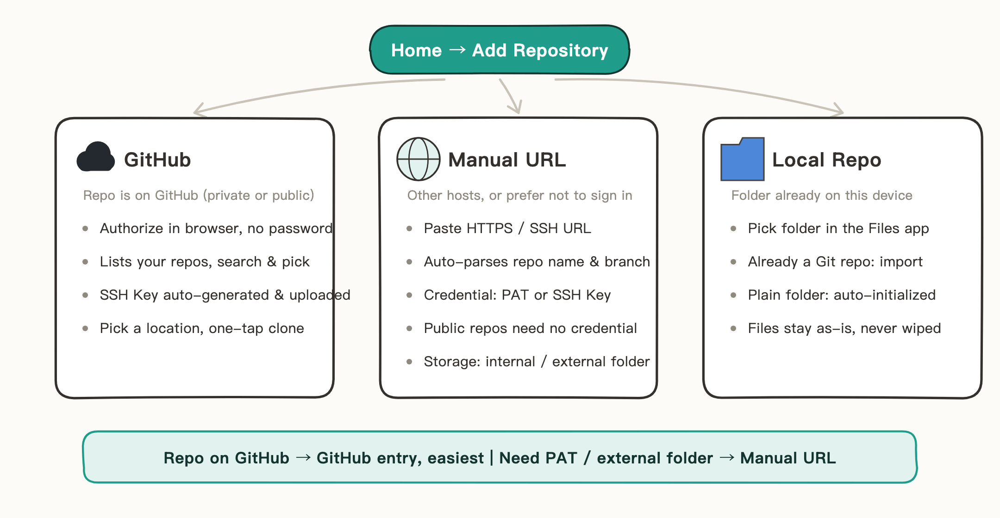
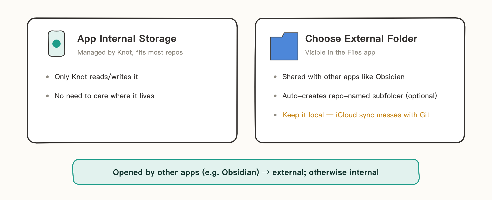
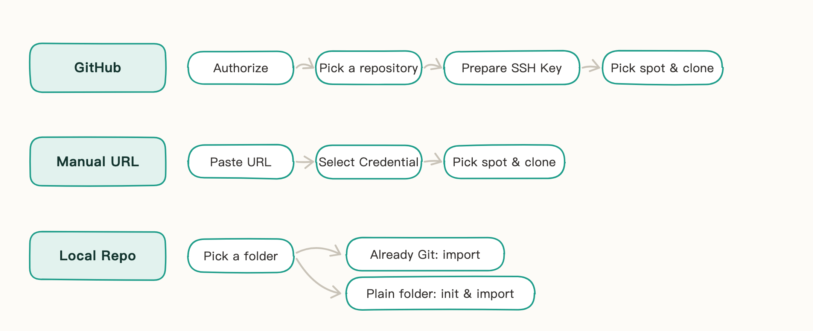

# Add a Repository

Every repo you hand over to Knot starts at Home → Add Repository. Three entry points for three scenarios:

## Choose a Storage Location

Both "GitHub" and "Manual URL" clone a remote repository to your device, and both go through the same choice first: where the repo lives. This step decides whether apps other than Knot can read and write it.

- **App Internal Storage**: managed by Knot, and only Knot needs to read and write it — the default for regular repos.
- **Choose External Folder**: the repo lands somewhere visible in the Files app, for cases where other apps need access — like sharing one vault with Obsidian. In this case "Auto-create repo-named folder" is on by default — it creates a subfolder named after the repo inside your chosen location; turn it off if you want the repo contents to land directly in the chosen folder (turn it off for Obsidian — see [Sync Obsidian Vaults](07-Sync%20Obsidian%20Vaults.md)).

Three things to know:

- If the folder you pick isn't empty, Knot lists its contents and asks you to confirm — once confirmed, the folder is wiped before cloning, and this can't be undone; if a folder with the same name already exists, pick a different name.
- The storage location can't be changed once set — to move a repo, delete it and add it again.
- Keep external folders local (under On My iPhone), not in iCloud Drive: iCloud's sync mechanism can interfere with Git — let Git do the syncing.

Local Repository import skips this step: the repo stays in the folder you picked, and Knot manages it in place.

## The Add Flow for Each Entry Point

All three flows are guided by the UI. One picture shows each path:

A few things you can't see from the UI:

- **GitHub**: authorization happens on GitHub's official page, and Knot never sees your password; "Prepare SSH Key" generates or reuses an on-device key and uploads the public key automatically if your account is missing it. How it works and what it looks like: [GitHub Sign-In](02-Sign%20in%20with%20GitHub.md).
- **Manual URL**: the credential follows the URL — PAT for HTTPS, SSH Key for SSH, matched automatically to the current domain; pick "Public Repository" to skip credentials for public repos, or add a credential on the spot if none fits.
- **Local Repository**: folders that are already Git repos are imported directly, as long as a remote URL is configured and the same folder hasn't been added before; plain folders are initialized as Git repos first, with all files kept as-is, never wiped — to sync with a remote later, create an **empty** repository on your hosting service (don't check the option to auto-generate a README), set its URL, and push.

Once added, the repo appears on Home. For everyday commit, push, and pull, see [Git Operations](05-Git%20Operations.md).
