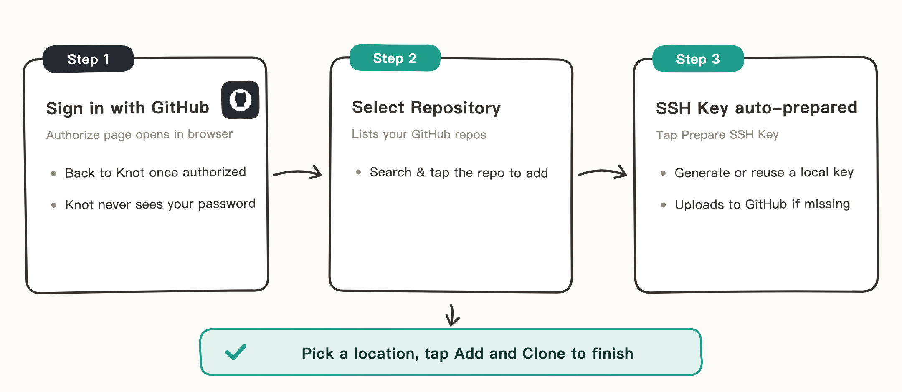

# GitHub Sign-In

If your repo lives on GitHub, this is the easiest way: sign in once, and picking repos and preparing the SSH Key are all done by Knot automatically — no manual credentials at all.

> The illustrations in this guide are hand-drawn sketches that keep only key UI elements — details may differ from the actual UI on your phone.

## When to Use

- Your repo is hosted on GitHub (private or public).
- You don't want to configure a PAT or SSH Key by hand.

## Sign In and Add a Repo

1. In Knot, add a repo, choose "GitHub", and tap "Sign in with GitHub".
2. The system browser opens GitHub's official authorization page; confirm and you return to Knot automatically. Authorization happens on GitHub's page — Knot never sees your password.
3. Pick the repo you want from the list (searchable).
4. Tap "Prepare SSH Key": Knot generates or reuses an on-device SSH Key, and uploads the public key automatically if your GitHub account is missing it.
5. Choose a storage location and tap "Add and Clone".

## Notes

- If your sign-in expires, just sign in again — repos you've already added aren't affected.
- To switch accounts, tap "Switch GitHub Account" on the add page.
- Public keys uploaded automatically can be viewed and managed under GitHub → Settings → SSH and GPG keys.
- If you'd rather not sign in, use "Manual URL" with a PAT or SSH Key instead — see the other two guides in this section.
