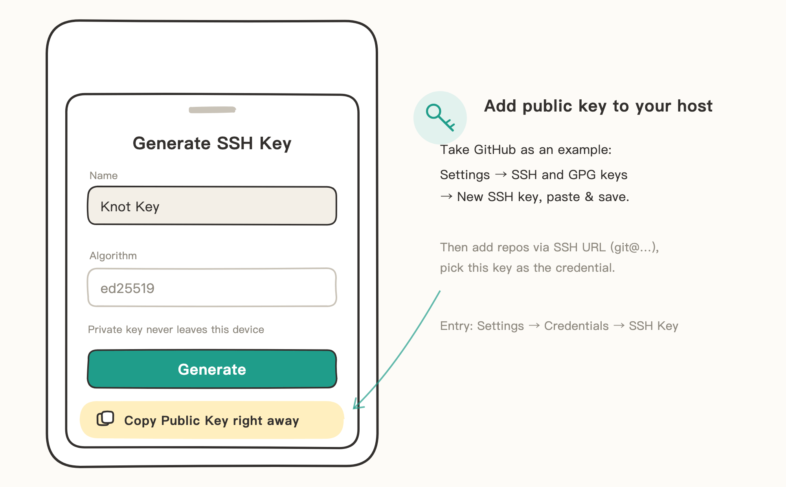
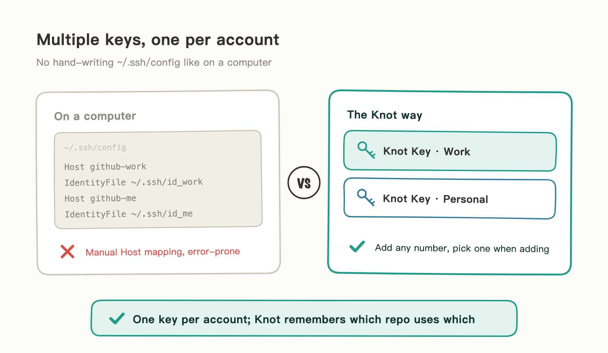
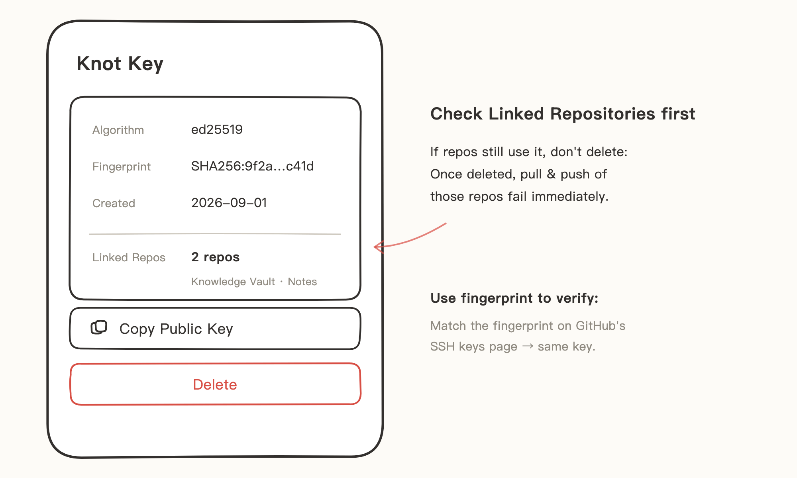

# SSH Keys

When you add a repo over an SSH URL (`git@github.com:…`), an SSH key proves your identity. Knot can generate a key pair directly (ed25519); attach the public key to your hosting service and it's ready to use.

You can add multiple keys: with several GitHub accounts, give each account its own key so each manages its own repos without interfering.

## When to Use
- Give this device its own key, managed separately from your computer's.
- You have multiple GitHub accounts (e.g., work + personal) to manage separately.

## Generate a Key and Attach It to Your Hosting Service

> The illustrations in this guide are hand-drawn sketches — details may differ from the actual UI on your phone.

1. Open Knot's Settings → Credentials → SSH Key, and tap "Add SSH Key".
2. Give it a name (default: Knot Key). The algorithm is fixed to ed25519. Tap "Generate".
3. Tap "Copy Public Key" once it's generated.
4. Add the public key to your hosting service. On GitHub: profile picture → Settings → SSH and GPG keys → New SSH key, paste and save.

From then on, add repos with SSH URLs and pick this key as the credential.

## Multiple Keys: Manage Several Accounts at Once

On a computer, using SSH with multiple GitHub accounts usually means hand-writing Host mappings in `~/.ssh/config` — tedious and easy to get wrong. **None of that in Knot**: add as many keys as you need, pick one from the list when adding a repo, and Knot remembers it per repo — pull and push each go through their own account.

Take work and personal GitHub accounts as the example:

1. Generate two keys with names you can tell apart, like "Knot Key · Work" and "Knot Key · Personal".
2. Add the two public keys to the two GitHub accounts respectively.
3. Pick the key for the matching account when adding a repo; you can switch it anytime in the repo's credential settings.

## Managing Existing Keys

Settings → Credentials → SSH Key lists all on-device keys. Tap any key for its details and actions:

- **Name / Algorithm**: set at generation; the algorithm is always ed25519.
- **Fingerprint**: looks like `SHA256:…` — use it to verify the key matches what your hosting service shows.
- **Creation time**.
- **Linked Repositories**: repos currently using this key.
- **Copy Public Key**: copy from here when attaching the same key to another hosting account or service.
- **Delete**: first make sure "Linked Repositories" is empty. If you delete a key that's still in use, pull and push for those repos fail immediately — switch them to another key in their credential settings first, then come back and delete it.

## Notes

- The private key stays on this device and is never uploaded; on a new device, generate a fresh key and add the new public key.
- You only need to add a public key once per hosting account; multiple repos under that account share it.
- None of this is needed when adding repos via GitHub sign-in — Knot prepares and uploads the public key automatically. See [GitHub Sign-In](02-Sign%20in%20with%20GitHub.md).
- Deleting only removes the on-device key; the public key already added on the hosting service has to be removed there separately if needed.
- If you suspect the private key has leaked: delete the matching public key on the hosting service first, then delete the key in Knot and generate a new one.
