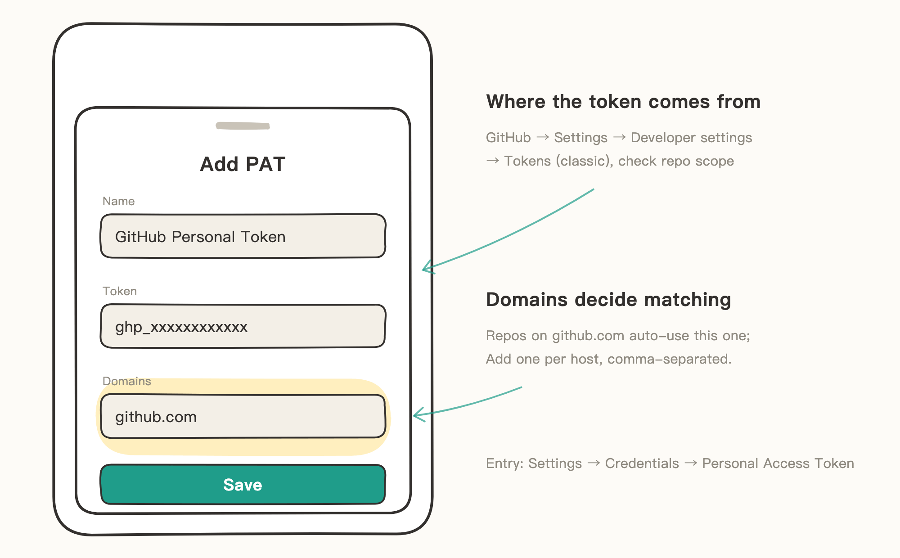

# Personal Access Token (PAT)

When you add a private repo over an HTTPS URL, the hosting service uses a token instead of a password to verify your identity. Knot manages tokens by domain: whichever domain a repo is on, that's the token it uses.

> The illustrations in this guide are hand-drawn sketches that keep only key UI elements — details may differ from the actual UI on your phone.

## When to Use

- You want fine-grained permission control: a token can be limited to specific repos, given an expiry, or restricted to read-only — more precise than signing in, suited for advanced users with permission requirements.
- You're adding a private repo over HTTPS and don't want GitHub sign-in or SSH.

Public repos don't need a token: when adding over HTTPS, choose "Public Repository" as the credential to clone directly.

## Step 1: Generate a Token on the Hosting Service

Using GitHub as the example:

1. Open github.com, tap your profile picture → Settings → Developer settings → Personal access tokens → Tokens (classic).
2. Tap "Generate new token (classic)" and check the `repo` scope (required to read and write repo contents).
3. Copy the token right away — you can't see it in full again once you leave the page.

For finer control, generate with "Fine-grained personal access tokens" instead: limit it to specific repos, read-only access, and a shorter expiry.

## Step 2: Add the Token in Knot

1. Open Knot's Settings → Credentials → Personal Access Token, and tap "Add PAT".
2. Name it anything you like (e.g., "GitHub Personal Token"); paste the `ghp_…` you copied into "Token"; enter `github.com` for "Domains".
3. Save.

The domains decide the match scope: when you later add repos from `github.com`, Knot matches this token automatically. Using multiple services? Add one token per service (e.g., another with domain `gitlab.com`).

## Notes

- A token is as good as a password — if it leaks, revoke it on the hosting service immediately.
- When a token expires or is revoked, edit this PAT under Credentials and paste in the new token — repos you've already added don't need any changes.
- Separate multiple domains with commas.
- Repos over SSH URLs (`git@…`) don't use PATs — they use SSH keys. See [SSH Keys](03-SSH%20Keys.md).
