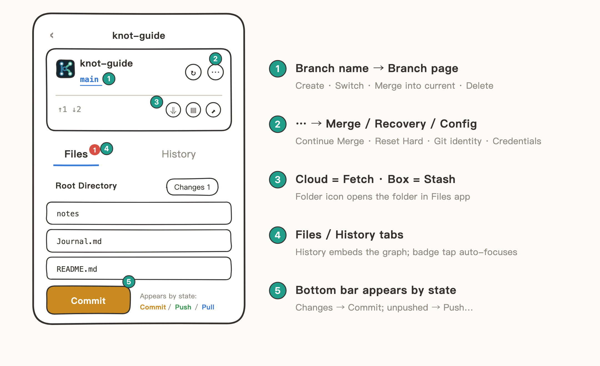
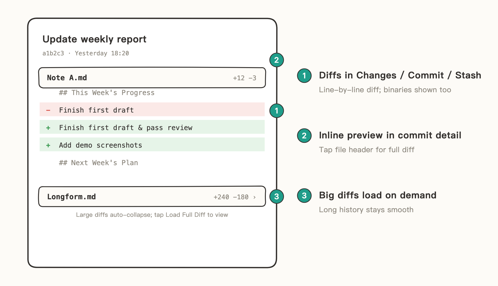
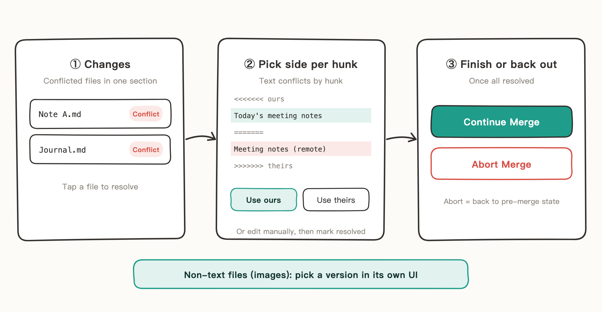
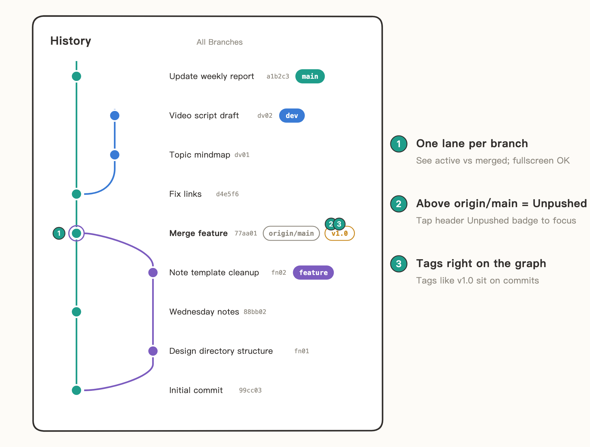
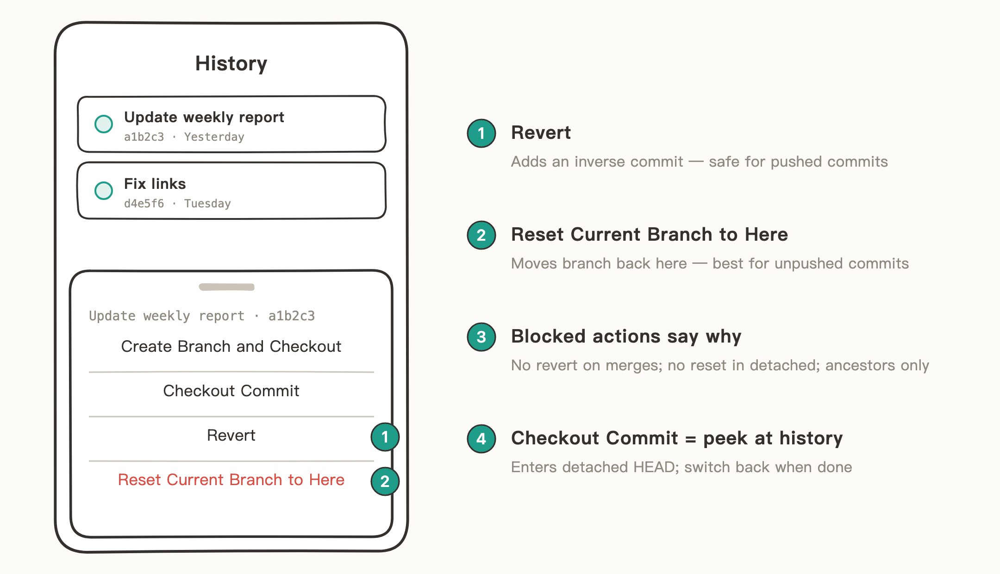

# Git Operations

Knot supports the full set of Git operations — Commit, Push, Pull, Fetch, Branch, Stash, Merge, Reset, Revert — all from the repo detail page.

Want to try it? [Try It Yourself](08-Try%20It%20Yourself.md) includes exercises for staging, committing, Stash, and conflict resolution.

| Operation | Where |
| --- | --- |
| Commit / Push / Pull | Bottom bar ("Commit" appears when there are changes, "Push" when there are unpushed commits, "Pull" when there are commits to pull) |
| Fetch | The cloud icon on the header card |
| Branch | Tap the branch name (e.g., main) in the header |
| Stash | The stash (box) icon on the header card |
| Reset / Revert | Tap any commit in the History tab |
| Merge / Recovery / Config | The "⋯" on the header card |

The bottom bar only shows the operations currently available, so you're never distracted by buttons that can't be tapped. Those are the everyday operations — here's where Knot goes further.

## Diffs You Can Actually See

Files in Changes, commit history, and Stash all show diffs, line by line in red and green:

- Each file in a commit's details previews inline; tap the file header for the full diff.
- Large diffs are collapsed by default — tap "Load Full Diff" to expand, keeping long histories smooth.
- Binary files like images get a proper visual treatment too, not just a "Binary files differ" line.

## Conflict Resolution: Merging on Your Phone

Conflicts from a pull or merge don't require switching to a computer:

1. Conflicted files get their own section on the Changes page; tap a file to resolve it.
2. Text conflicts are handled block by block: choose "Use ours" or "Use theirs", or edit manually, then mark as resolved; for non-text files (images, etc.), just pick which version to keep.
3. Resolve everything and "Continue Merge" to finish; changed your mind? "Abort Merge" returns you to the pre-merge state.

## Commit Graph: Branch Relationships at a Glance

The History tab embeds a commit graph — the flow of every branch and every merge point, directly visible, with fullscreen support. Tap the Unpushed / Unpulled badge on the header card and the graph jumps straight to the matching commits.

## Safe Reset / Revert

Tap any commit in History to open its action menu: Create Branch and Checkout / Checkout Commit / Revert / Reset Current Branch to Here.

- Operations that can't be done say why upfront: Reset analyzes first and can only go back to ancestors of the current branch; merge commits can't be reverted; Reset is unavailable with a detached HEAD.
- For commits already pushed, use Revert — it adds an inverse commit without rewriting history; only commits not yet pushed should use Reset.

## More Thoughtful Details

- **Switch branches with Stash**: switch branches even with uncommitted changes — they're stashed away, not lost.
- **First push of a new branch**: Knot asks whether to set it as the upstream; after that, Push/Pull is one tap.
- **Git identity check before committing**: if it's not configured, Knot guides you to set it up — no anonymous commits.
- **Recovery section** (the "⋯" panel): Reset Hard to HEAD (discard all uncommitted changes), Delete Stale Index Lock — no need to delete the repo and start over.
- **Obsidian repo detection**: when an Obsidian repo is detected, Knot offers to set up .gitignore. See [Sync Obsidian Vaults](07-Sync%20Obsidian%20Vaults.md).
