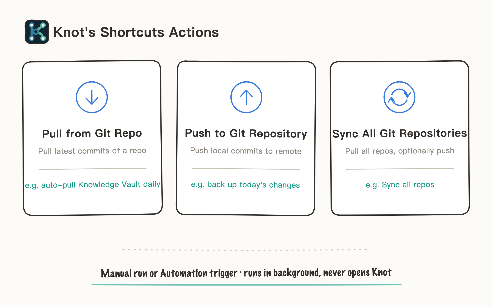
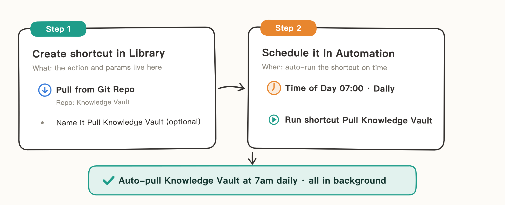
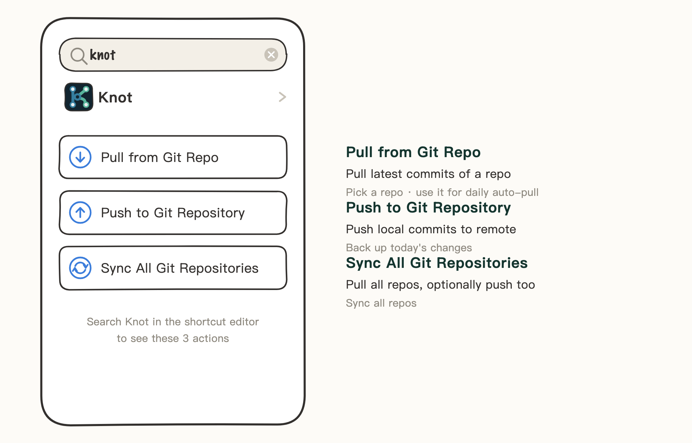
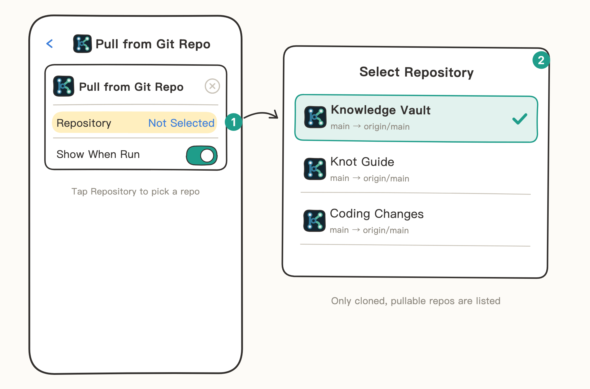
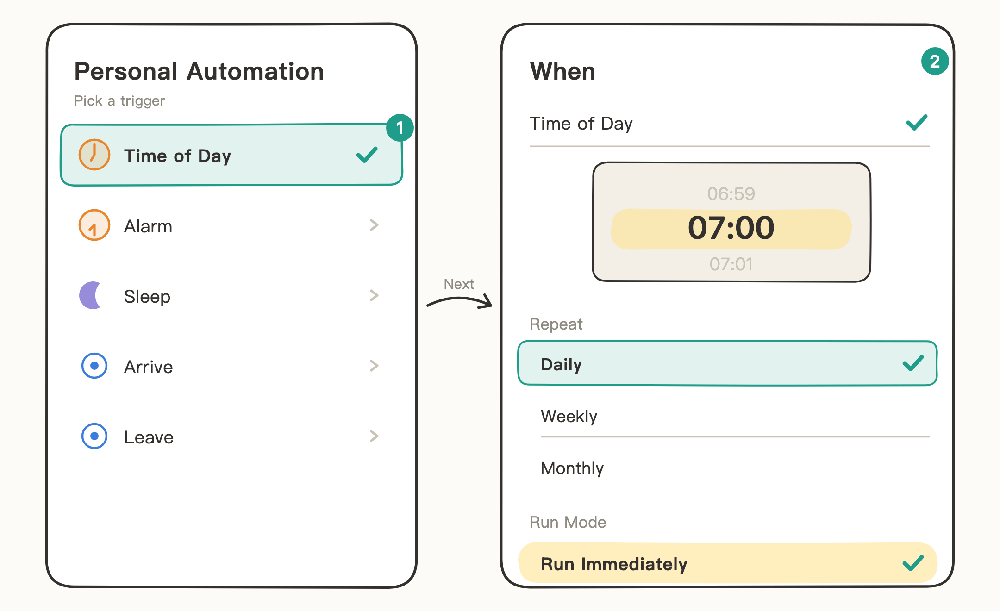
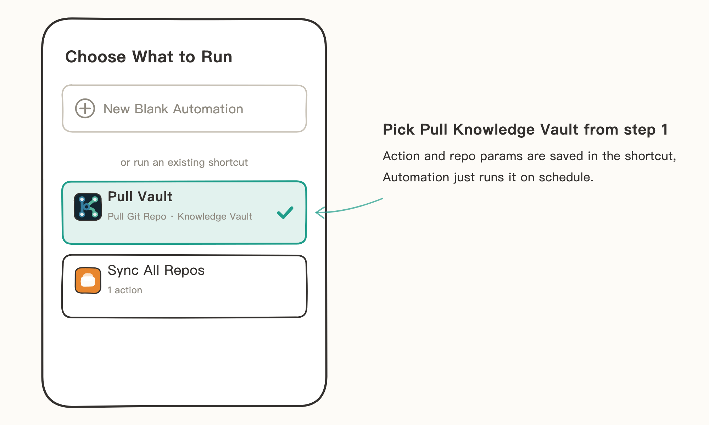
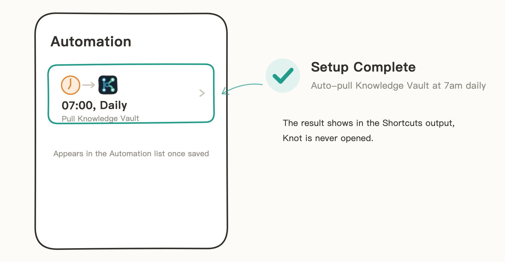

# Shortcuts

Knot gives the iOS Shortcuts app 3 actions: pull, push, and sync all repos. Run them on a schedule or with one tap — everything happens in the background without opening Knot.

> The illustrations in this guide are hand-drawn sketches that keep only key UI elements — details may differ from the actual UI on your phone.

## When to Use

- **Automatic daily pull**: pull your Knowledge Vault every morning, so Obsidian is up to date when you open it.
- **One-tap backup**: tap Push to send today's changes to the remote.
- **Batch sync**: one shortcut pulls all repos, optionally pushing too.

## Build a "Pull Knowledge Vault at 7 AM Every Day" Automation

Using the Knowledge Vault repo as the example. The setup has two parts: build the shortcut in Library first, then schedule it in Automation.

### Step 1: Build the Shortcut in Library

The action and the repo parameter live inside the shortcut — once built, it's a standalone shortcut that runs on its own.

1. Open the Shortcuts app, switch to "Library" at the bottom (all shortcuts you create live here), and tap "+" in the top right.
2. Search for "Knot" and pick "Pull from Git Repository".

   Knot provides 3 actions in total — pull, push, sync all; here we use "Pull from Git Repository".

   

3. Tap the "Repository" parameter on the action card and pick Knowledge Vault from the list.

   

4. Tap "Done". The shortcut appears in your Library. Tap ▶ on its card anytime to pull manually.

### Optional: Give the Shortcut a Good Name

Long-press the shortcut card, choose "Rename", and change it to something like "Pull Knowledge Vault". Distinct names help when you have multiple repos — and saying the name to Siri triggers the pull directly.

### Step 2: Schedule It in Automation

1. Switch to "Automation" at the bottom and tap "New Automation" (or "+" in the top right if you already have automations).
2. Pick a trigger. Here, choose "Time of Day" (opening an app, etc. also work): set the time to 07:00, repeat "Daily", and pick "Run Immediately", so it runs right on time without asking for confirmation.

   

3. Tap "Next", and when asked what to run, pick the "Pull Knowledge Vault" shortcut you built in step 1.

   

4. Once saved, it shows up in the Automation list: 07:00, Daily — pulling Knowledge Vault. Every morning at 7 it pulls automatically, never opening Knot.

   

## Notes

- All three actions run in the background; results appear in the shortcut's output, and Knot never opens.
- Sync via Shortcuts is limited by Knot's in-app purchase quota; without unlocking, the actions will ask you to unlock in Knot first.
- A repo that was just added and hasn't finished its first clone won't show up in the "Pull from Git Repository" picker: finish one clone in Knot first.
