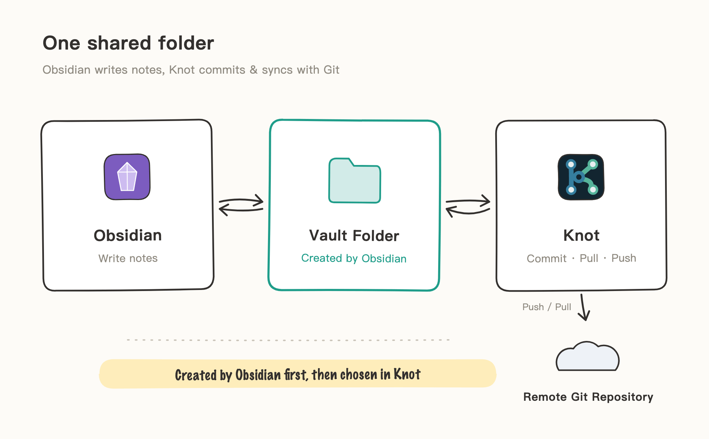
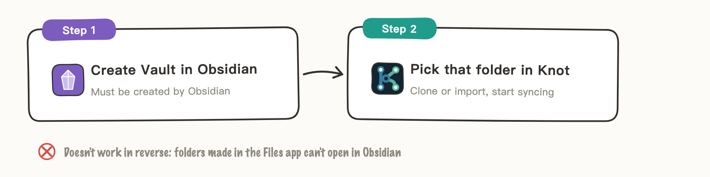
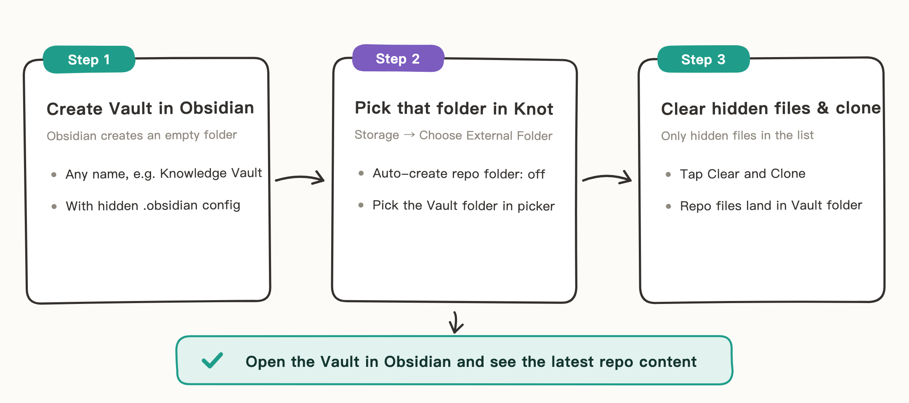
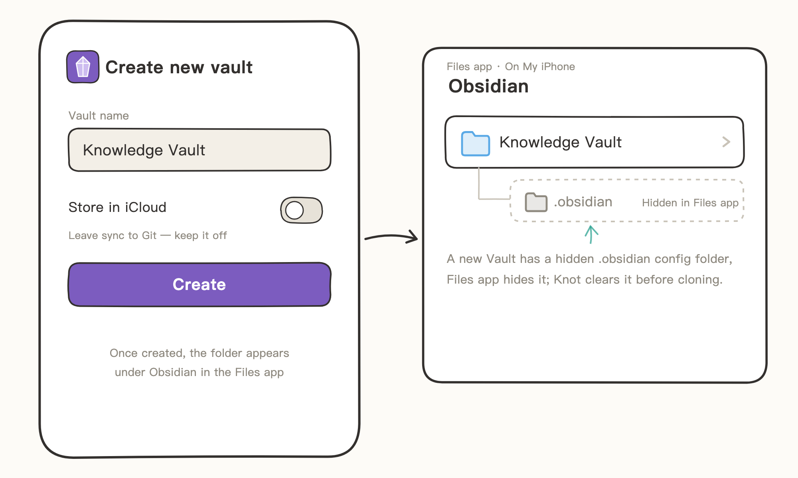
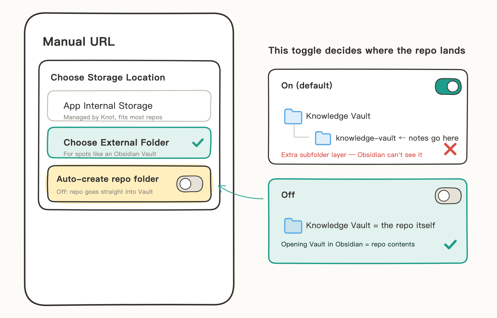
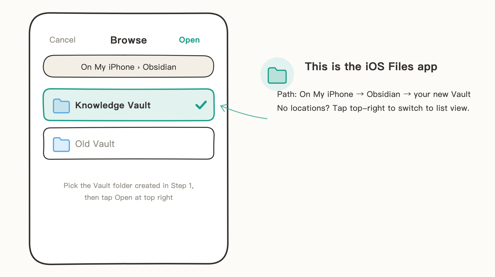
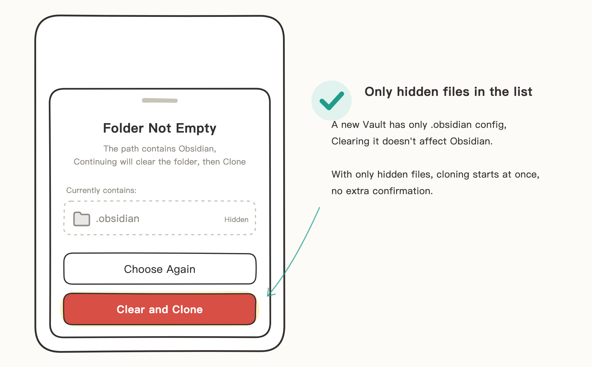
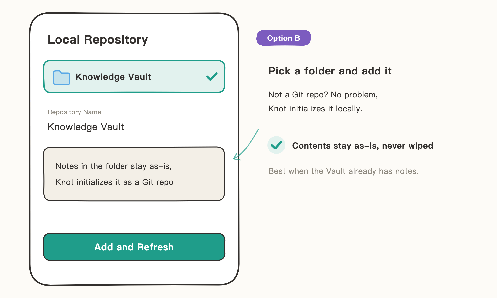

# Sync Obsidian Vaults

Knot and Obsidian work together by sharing one folder: Obsidian writes notes in it; Knot handles Git commits, pulls, and pushes for it.

Obsidian only recognizes folders it created itself, so the order is fixed: create the vault in Obsidian first, then pick that folder in Knot. A folder you make yourself in the Files app won't open in Obsidian.

> The illustrations in this guide are hand-drawn sketches that keep only key UI elements — details may differ from the actual UI on your phone.

## When to Use

- **Pull an existing Knowledge Vault to a new device**: the vault repo already exists on a remote, and you want to keep writing in Obsidian on iPhone / iPad.
- **Add Git sync to an existing vault**: the vault already has notes, and you hand commits and sync over to Knot.

## Two Ways In

- **Option A: New vault + clone (recommended)** — the vault repo exists on a remote and you're starting fresh on this device: create an empty vault in Obsidian, and Knot clears its hidden config files and clones the repo in.
- **Option B: Import an existing vault** — the vault has notes you can't wipe: Knot initializes it as a Git repo and imports it, contents kept as-is.

## Option A: New Vault + Clone (Recommended)

Example: pulling a remote Knowledge Vault repo to this device. The whole setup takes three steps:

### Step 1: Create the Vault in Obsidian

1. Open Obsidian and create a new vault with any name (e.g., Knowledge Vault). Keep "Store in iCloud" off — sync is Git's job; don't let iCloud manage the same files too.
2. Once created, the folder appears under On My iPhone → Obsidian in the Files app. It already contains a hidden `.obsidian` config folder — the Files app doesn't show it by default, but it's there; Knot clears it before cloning.

### Step 2: Add a Repo in Knot and Pick This Folder

Add a repo in Knot. When the flow reaches storage location, choose "Choose External Folder", then turn off "Auto-create repo-named folder" (on by default).

- On: Knot creates a subfolder named after the repo inside your chosen folder — notes would land in that subfolder where Obsidian can't see them.
- Off: the repo goes directly into your chosen vault folder.

Next, the iOS Files app opens: go to On My iPhone → Obsidian (if the locations aren't showing, tap the list-view toggle in the top right), and select the vault folder from step 1.

### Step 3: Clear Hidden Files and Clone

Once you pick the folder, Knot detects it isn't empty (it contains `.obsidian`) and shows a list of the contents. Confirm the list only has hidden files like `.obsidian`, then tap "Clear and Clone". An Obsidian folder containing only hidden files skips the second confirmation — clearing and cloning begin right away.

When the clone finishes, go back to Obsidian and open the vault — its contents are now the latest state of the remote repo. Writing notes, committing, pushing: both apps work on the same folder from here on.

## Option B: Import an Existing Vault

Use this when the vault has notes you can't wipe. After you pick the folder, Knot initializes it as a Git repo and imports it — contents stay as-is, never wiped.

1. Add a repo in Knot and choose "Local Repository".
2. In the Files app that opens, select the vault folder (path: On My iPhone → Obsidian).
3. Confirm the repo name and tap "Add and Refresh".

## Notes

- "Auto-create repo-named folder" is on by default; remember to turn it off when sharing a folder with Obsidian, or the repo lands one level down in a subfolder inside the vault, invisible to Obsidian.
- "Clear and Clone" deletes everything in the folder. If the remote repo carries its own `.obsidian` config, it's restored after cloning; if not, Obsidian rebuilds a default config the next time it opens the vault.
- If the folder contains anything besides hidden files, "Clear and Clone" asks for confirmation once more — if you're not sure what's in there, check in the Files app before tapping.
- A folder that's already a Git repo can't be a clone target (Knot will ask you to pick an empty folder); import it via "Local Repository" instead.
- The storage location can't be changed once set; to move the repo, delete it and add it again.
